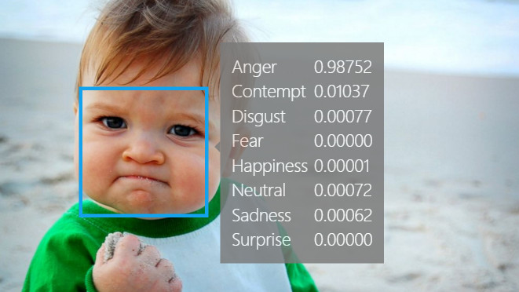

# Mini-Project for Fundamentals of Machine Learning Course

This repository contains the code and data for a mini-project on facial expression recognition using machine learning algorithms.

## 📑 Project Policy

- Team:
- | No. | Student Name                    | Student ID |
  | --- | ------------------------------- | ---------- |
  | 1   | Trịnh Minh Anh                 | 21280005   |
  | 2   | Nguyễn Phúc Gia Nghi          | 21280035   |
  | 3   | Nguyễn Lưu Phương Ngọc Lam | 21280096   |

## 📊 Results

The performance of 3 model (XGBoost, CatBoost, LightGBM) and Encoder CNN

Insert 

## 📦 Project Structure

The repository is organized into the following directories:

- **/data**: This directory contains the facial expression dataset. You'll need to download the dataset and place it here before running the notebooks. (Download link provided below)
- **/notebooks**: This directory contains the Jupyter notebook ``EDA.ipynb``. This notebook guides you through exploratory data analysis (EDA) and classification tasks.
- **/models:** This directory folder stores pretrain models.

## ⚙️ Usage

This project is designed to be completed in the following steps:

1. **Fork the Project**: Click on the ``Fork`` button on the top right corner of this repository, this will create a copy of the repository in your own GitHub account. Complete the table at the top by entering your team member names.
2. **Download the Dataset**: Download the facial expression dataset from the following [link](https://mega.nz/file/foM2wDaa#GPGyspdUB2WV-fATL-ZvYj3i4FqgbVKyct413gxg3rE) and place it in the **/data** directory:
4.
